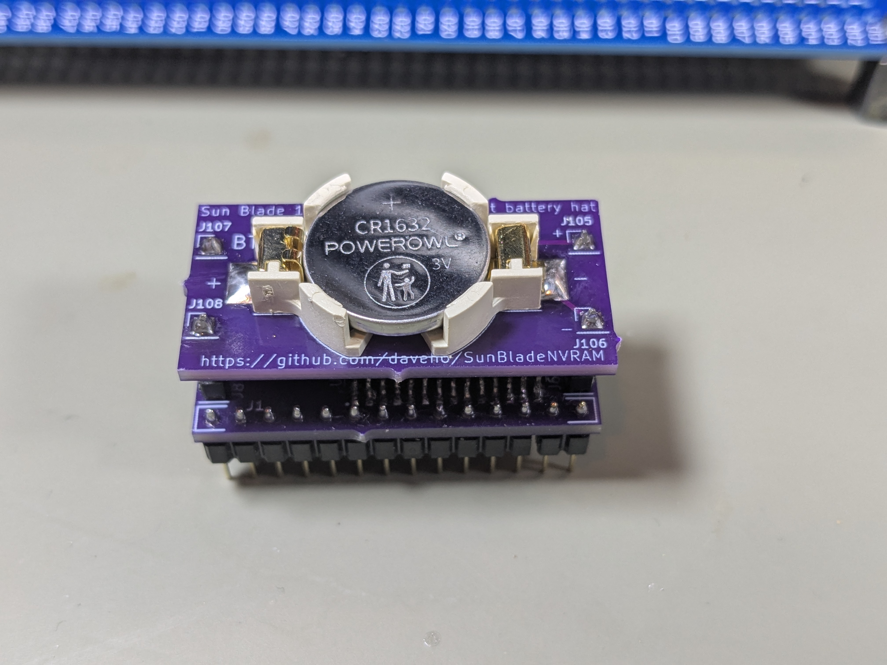

# M48T59Y replacement module

I designed a replacement for the M48T59Y-70PC1 NVRAM/RTC module used in some
Sun workstations, such as the Sun Blade 150:

All of the project files, including the KiCad project, assembly
instructions, and a design for an Arduino-based tester/programmer, are here:

<https://github.com/daveho/RandomStuff/tree/master/Episode0a>
